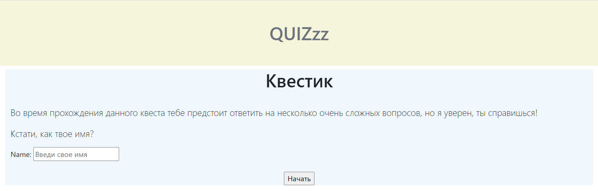
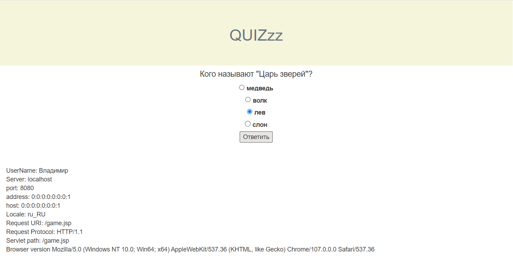
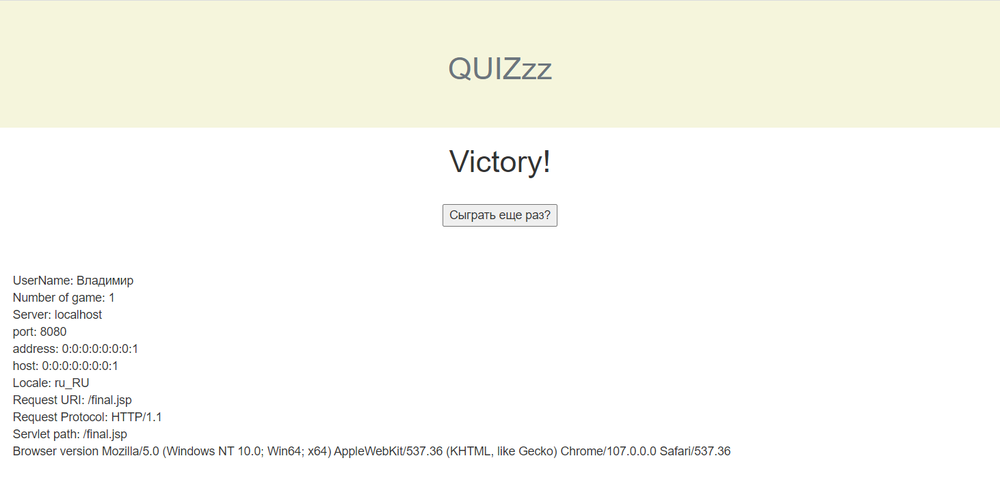

<h1 align="center">Итоговый проект третьего модуля JavaRush.</h1>
<h1 align="center">QUIZzz.</h1>

#### Владимир Кривко.

#### GitHub: *https://github.com/VladimirKrivko/ru.javarush.golf.module3.quest.krivko* &emsp;&emsp;&emsp;*(ветка dev)*

#### Менторы: @Andrii Shylin (UA, Kyiv), @Yuriy Syrovatko.

---

## Задача:
&emsp; Написать небольшой текстовый квест. Вопрос на каждом следующем шаге зависит от предыдущего ответа.

### Обязательные требования:
- Это должен быть Maven проект с использованием таких технологий: сервлеты, jsp, jstl. ✅
- Для запуска при тестировании будет использоваться Tomcat 9. ✅
- Версия: Java 11. ✅
- добавить страницу-приветствие, в которой написать текст приветствие, рассказывающий предысторию к этому текстовому квесту-игре. ✅
- После победы или поражения должна быть возможность начать игру заново. ✅
- Какая-то информация должна храниться в сессии. Это может быть имя игрока, количество сыгранных игр или еще что-то на твое усмотрение. ✅
- Логика должна быть покрыта тестами. Используй JUnit.

---

## Стартовая страница:
_*src/main/webapp/index.jsp*_

---

## Скриншоты:

---

---

---
<h4 align="center">Перед погружением в код, рекомендую взять дежурный противогаз 😁.</h3>

<h3 align="center"> 😵 Спасибо за внимание! 🤘 </h3>

